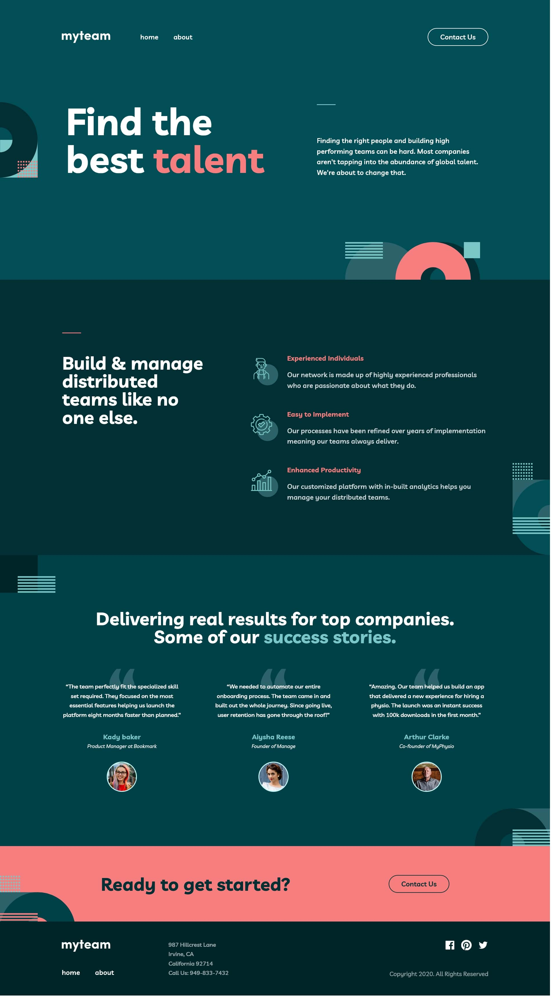
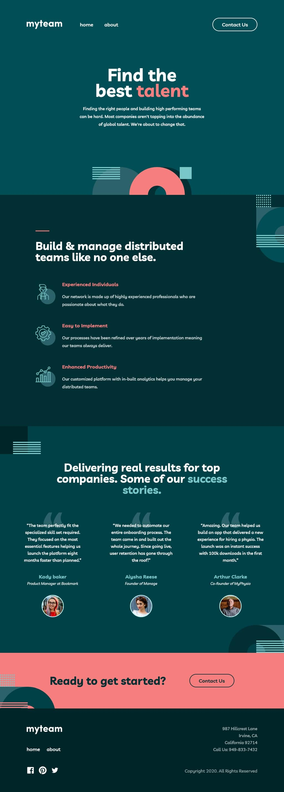
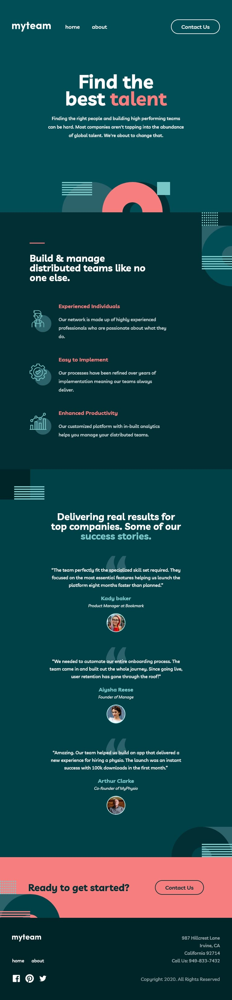
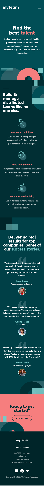

## Table of contents

- [Live Demo](#live-demo)
- [Overview](#overview)
    - [The challenge](#the-challenge)
    - [Screenshots](#screenshots)
- [My process](#my-process)
    - [Built with](#built-with)
    - [Continued development](#continued-development)

## Live Demo

https://jamcmich.github.io/electriq-exercise/

## Overview

### The challenge

Users should be able to:

- ✅ ~~View the optimal layout for each page depending on their device's screen size~~
- ✅ ~~See hover states for all interactive elements throughout the site~~
- ✅ ~~See the correct content for each team member on the About page when the `+` icon is clicked~~

### Screenshots

#### Desktop View

#### Laptop View

#### Tablet View

#### Mobile View

### Build with

- ✅ ~~Semantic HTML5 markup~~
- ✅ ~~CSS~~
- ✅ ~~Javascript~~
- ✅ ~~Mobile-first workflow~~
- ✅ ~~Vite.js for optional CSS code splitting and bundling on runtime~~
- ✅ ~~Responsive web design~~
- ✅ ~~Media queries for popular device widths~~
- ✅ ~~Single-file CSS~~
- ✅ ~~Cross-browser compatibility~~
- etc.

### If I had more time on this project what would I improve and why?

1. One of my best strengths is translating design systems into code and building a foundation for modular, scalable websites. While I have ample experience assuming both developer and designer responsibilities, I would have appreciated an opportunity to gain more context in regard to the client's needs, design philosophies, development strategies, outsider perspectives, collecting senior developer guidance, etc. before diving into the materials.

2. Even though writing traditional HTML, CSS, and JavaScript is a skill I've been practicing for many years, it took me awhile to get acclimated with the basics again. Since I've integrated frameworks such as React, Vue, SASS, and Tailwind into my daily workflow, the limitations that came with coding in vanilla HTML/CSS/JavaScript made processes more tedious and repetitive than I was used to. Even though it provoked ways of finding new solutions to previously met problems, I would have preferred to use modern libraries to build the website.

3. I often get caught up in the details and spend too many resources on a single problem. For instance, I noticed the design files included layouts for mobile, tablet, and desktop resolutions, but not small or large laptops. I decided to include styles for these missing devices to uphold a more responsive experience for potentially affected users. Even though I was trying to be thoughtful, this process detracted time from a core feature (the Contact page) and I would have preferred to build it given a slightly longer timeline.

> Thank you again for this opportunity!